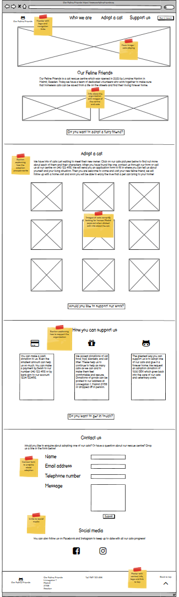
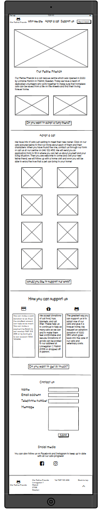
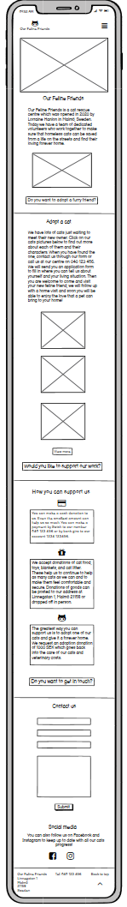
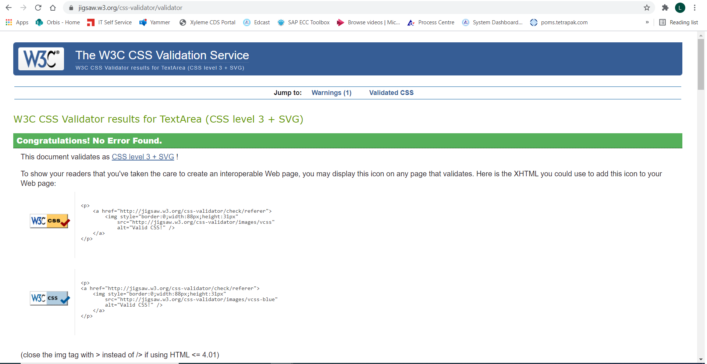
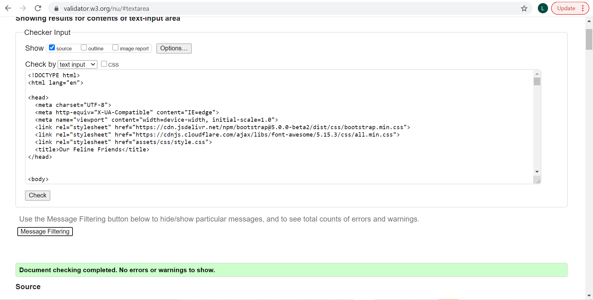
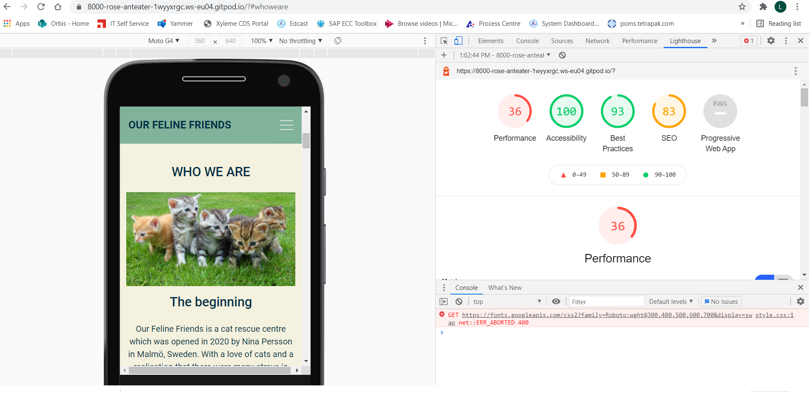

# Our Feline Friends

## Milestone Project 1 - User Centric Front-end Design

[Visit my website.](https://lorrainehanlon.github.io/ourfelinefriendsMS1-/)

The brief is to build a static front-end site using HTML and CSS, and based on the principles of UX design. This website is for educational purposes.

## UX

### Project Goals
The goal of this site is to inform users about the work of the cat shelter and lead them to considering adopting a cat, making a charitable donation and getting in touch. Users will be encouraged to return to the site to see new cats that are available to adopt.  

### User Stories

1. As a potential cat adopter, I want to find about the organisation and the process involved in adopting a cat.
2. As a potential cat adoptor, I want to see pictures and find out about cats looking for a home.
3. As a potential cat adoptor, I want to know how to make contact to start the adoption process.
4. As a cat lover, I want to know how I can support this organisation in their work.
5. As a cat lover, I want to see lots of pictures of cats.
6. As a cat lover, I want to know about other ways I can follow the work of the organisation and the cats that are being saved from the streets.

### Design

#### Typography
I have chosen Roboto as a clear informative font, this site aims to allow the user to quickly take in the information and move to the area of the site they require. 

#### Colour scheme
I wanted soft colours to allow the pictures of cats to shine and not distract from the content of the site. Using a light cream for the main body backgroud achieved this. The header and footer are in a complementary grean shade, which gives a contract but is not too severe to the eye. 

#### Imagery
I chose to have a large three picture carousel in my home page with images of the the cats that have been cared for at the cat shelter. It is bold and leaves the user in no doubt of what the site is about. Throughout the site further images of cats are used to inform the user about the cats that are currently available for adoption and to show the cats in happy condition now that they have been taken off the streets. 

### Wireframes
I created 3 wireframes to display the responsive design of my site.

Desktop Wireframe

 

Tablet Wireframe

 

Mobile Wireframe 

 

## Features
I decided to create a single page website with 3 sections rather than a 3 page site. I created sections for "who we are" "Adopt a cat" and "Support us". This leads the user through the story of how the shelter came to be, how to adopt a cat and the cats currently available and then if the user is not in a position to adopt, they can see other ways to support the shelter.

The site follows structured layout starting with a header with fixed navbar always available to the user as they scroll, allowing them to navigate easily to different parts of the site. The navbar includes links to the three main sections. A carousel is used below the header with large images of cats that highlight the reason for the shelter and quickly cnofirm what this site is all about - cats.

The "Who we are" section quickly gives the user information on when the shelter was established, it's purpose and where it is. This is enhanced with an image of the shelter and some of the volunteers.

The "Adopt a cat" section gives an explanation of the process of adoption followed by a set of images of indiviual cats awaiting adoption along with a description of each. 

The "Support us" section details three ways users can contirbute to the shelter, through cash and goods donations and adoption. Each point is illustrated by icons.

This then leads on to the "Contact Us" form where users can enquire about adopting a cat or submit any questions they may have.

The footer contains contact details such as telephone number and address along with social media links and a link back to the top of the page. 

## Technologies used
* HTML
* CSS
* Bootstrap - started with the carousel template from Bootstrap and adjusted to it meet my site vision. Also used snippets from Bootstrap such as modal and form
* TinyPNG - for compressing images
* Gitpod - used as development environment and for version control
* Github - used to host my code to was created in Gitpod
* Balsamiq- used to create wireframes for desktop, tablet and mobile
* Chrome Developer Tools - used throughout to assess responsiveness and to help with styling
* Font Awesome to add icons
* Google Fonts to assign font to my site
* Free Formatter to beautify CSS
* Minify Code to beautify HTML
* W3C CSS Validation Service to validate CSS code
* W3C HTML Validation Service to validate HTML code
* Lighthouse in Developer Tools to evaluate performance and accessibility

## Testing

### UX stories testing

1. As a potential cat adopter, I want to find about the organisation and the process involved in adopting a cat.
* The site guides the user intuitively though the story of the cat shelter and on to the cats available and how to apply to adopt them. The navbar and carousel have links to take the user straight to the secton they are looking for.
2. As a potential cat adoptor, I want to see pictures and find out about cats looking for a home.
* In the Adopt a Cat section, the user is tolf the process of adoption and below this is a set of oicture of the available cats and when each picture is clicked a modal give further information about the cat and their personalities.
3. As a potential cat adoptor, I want to know how to make contact to start the adoption process.
* As above, this is explained in the Adopt a Cat section with refernece to the contact form. The contact form is also highlighted in the navbar with a call to action button.
4. As a cat lover, I want to know how I can support this organisation in their work.
* In the Support Us section, the user can read about the different ways they can support the shelter. Icons are used to reinforce the messages.
5. As a cat lover, I want to see lots of pictures of cats.
* Cat lovers are usually BIG fans of cats so I have used many attractive images of cats through out the site. Upon loading the site the user sees a full screen carousel of 3 cat images, leaving them in no doubt of the subject of this site.
6. As a cat lover, I want to know about other ways I can follow the work of the organisation and the cats that are being saved from the streets.
*The user is encouraged to return to the site as the available cats are updated frequently. Also the footer contains links to the shelters social media - Instagram and Facebook.

### Validation

1. I used W3C CSS Validation Service to validate my CSS code

CSS Validation Results

 

2. I used W3C HTML Validation Service to validate my HTML code 

HTML Validation Results

 

3. I used Lighthouse in Developer Tools to evaluate the performance and accessibility of my site

Lighthouse Performance Results

 

## Deployment

My site is hosted using GitHub, deployed directly from the master branch. 

To run locally, you can clone this repository directly into the editor of your choice by pasting git clone into your terminal. 

To deploy my website I completed the following steps:

1. I clicked on the Settings tab in my GitHub repository.

2. I selected Pages from the sidebar menu and chose the Master branch as the source to enable GitHub Pages.

3. I then clicked Save and the URL to the live site was generated.

4. I then followed the link to observe and verify the published GitHub page. 

## Credits 

### Content
Text content all original by me. 

### Media
Carousel images and cats for adoption images from www.pexels.com
Volunteer image from www.cattime.com

